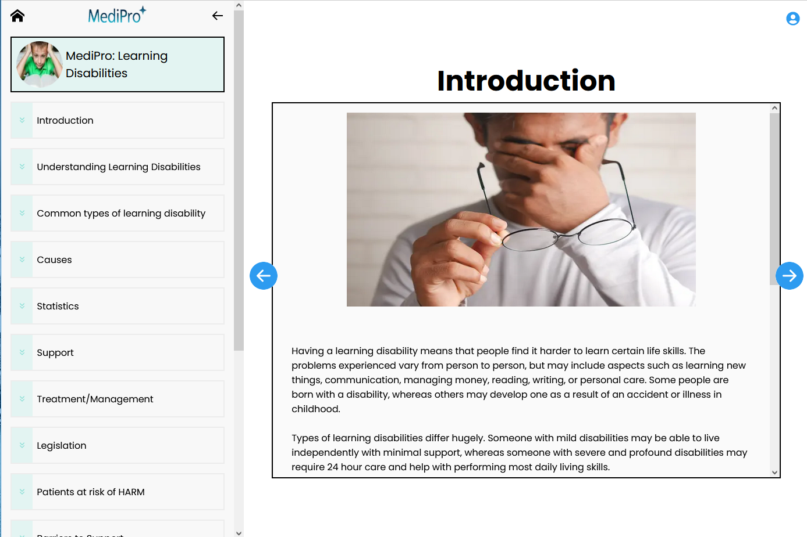
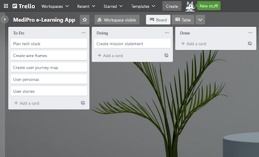
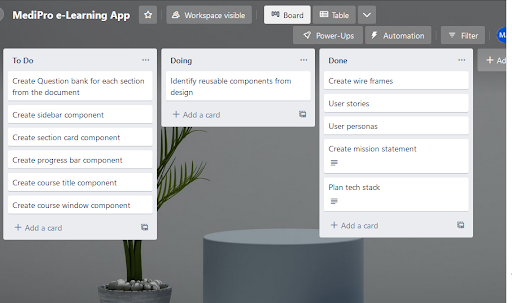
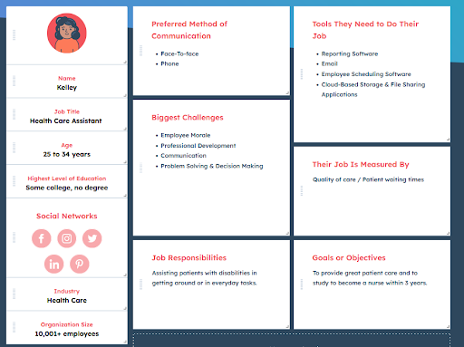
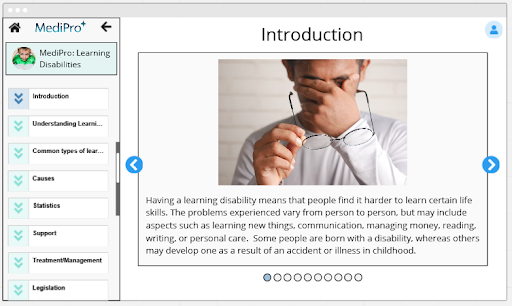
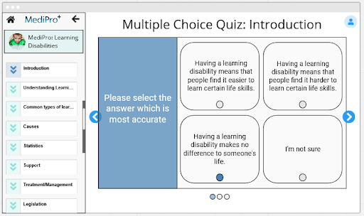
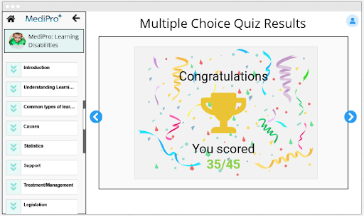
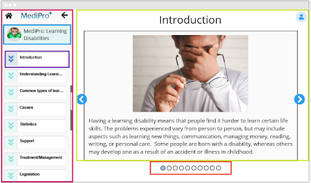

# MediPro: Learning Disabilities

**[WEBSITE DEMO LINK](https://medipro-learning-disabilities.netlify.app/Causes)**

## **Problem statement:**

People with learning disabilities do not learn certain skills as quickly as other people, and may therefore need extra help in certain aspects of their lives. The specific skills in question will depend upon the type of disability.

## **Solution:**

This app aims to educate and inform its users on the different types of learning disabilities people live with, while also providing practical ways of assisting them in their day-to-day lives.

## MVP requirements / features

**Must Have:**

- Original text from document
- Interactivity e-learning format

**Like to Have:**

15 small learning sections based on the document

- Introduction
- Understanding Learning Disabilities
- Common types of learning disability
- Causes
- Statistics
- Support
- Treatment/Management
- Legislation
- Patients at risk of HARM
- Barriers to Support
- Inequalities in Health for Learning Disabilities
- Access to healthcare
- Annual health checks
- Associated health conditions
- Reasonable adjustments

**Features:**

- Animated slide show with text and images from document.
- Ability to play audio narration of text.
- Short multiple question quiz at the end of each section.
- Semantic HTML and focus mode.
- Final quiz score and certificate of completion.
- Confetti based on score.
- Certificate sharable on social media.

## Planning

**Day 1 Trello board**

**Day 2 Trello board**

**User persona**

**User Story**

- As a health care assistant.

- I want to understand how having a learning difficulty effects my patients.

- So that I can make sure that I can provide the best possible care for them.

**Wireframes**

**Identifying reusable components from wireframe**

## Built with:

- HTML
- CSS
- JavaScript
- Next.js
- CSS Modules

## Getting Started:

Clone the repo as instructed below

## Prerequisites:

No prerequisites

## Installation

1.  Clone the repo

`git clone https://github.com/CodeNameMoe/medipro-elearning-dev-test`

2. npm run dev
